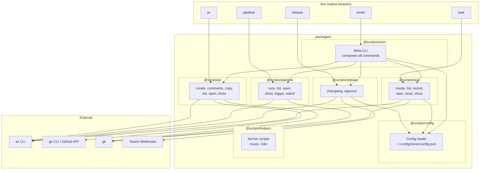

# Architecture

## Overview
Monorepo of Bun-native CLI tools organized as npm workspaces. Each domain (pr, pipeline, release, task) is a self-contained package that can run standalone or be composed into the `eimer` meta-CLI. All Azure DevOps interaction is delegated to the `az` CLI via subprocess invocation.

## System Diagram

## Components

### `@scripts/eimer` - Meta CLI
- Imports command definitions from all domain packages
- Registers them as subcommand groups (`pr`, `pipeline`, `release`, `task`, `configure`)
- Compiles to single `bin/eimer` native binary

### `@scripts/pr` - PR Workflows
- Dual-platform: Azure DevOps (via `az repos pr`) and GitHub (via `gh` or API)
- Auto-detects platform from git remote URL
- Commands: create (with auto-complete + squash), comments, copy, list, open, show

### `@scripts/pipeline` - Pipeline Operations
- Azure DevOps builds via `az pipelines` CLI
- Auto-detects repo from git remote; supports Azure DevOps + GitHub-hosted repos
- Commands: runs, list, open, show, trigger, watch (polling)

### `@scripts/release` - Release Workflows
- Changelog generation from pipeline commit ranges
- Teams webhook posting (Adaptive Card with MessageCard fallback)
- Editor integration (VS Code save-to-post flow)
- Commands: changelog, approve
- Also published as `@tapio/release` via Azure Artifacts (see [feature spec](features/001-release-publish.md))

### `@scripts/task` - Task Management
- Azure DevOps work items via `az boards`
- Defaults from config (team, area path) with built-in fallbacks
- Current sprint iteration detection
- Commands: create, list, recent, start, close, show

### `@scripts/config` - Shared Configuration
- Read/write `~/.config/eimer/config.json`
- Zod-validated schema: teams webhook, task defaults, release defaults
- Consumed by release, task, and eimer packages

### `@scripts/helpers` - Utility Scripts
- Standalone scripts not part of the eimer CLI
- Music collection/tagging, i18n duplicate detection
- Uses tsx + execa (separate toolchain from Bunli packages)

## Data Flow

### Typical Command (e.g., `eimer pr create "feat: new thing"`)
1. `eimer` binary -> loads meta CLI -> dispatches to `@scripts/pr` create command
2. Command reads current git branch via `Bun.spawn(["git", "branch", "--show-current"])`
3. Parses repo name from `git remote get-url origin`
4. Ensures branch is pushed to remote
5. Creates PR via `az repos pr create` -> parses JSON response
6. Enables auto-complete via `az repos pr update`
7. Opens PR URL in browser via `open`

### Config Flow
1. Commands call `loadConfig()` from `@scripts/config`
2. Reads `~/.config/eimer/config.json` -> Zod-parses -> returns typed config
3. Commands use config values as defaults, with hardcoded fallbacks

## Deployment

### Local (personal)
- Native binaries in `bin/` built via `bunli build --native`
- Build: `bunli build --native --outfile ../../bin/<name>` per package
- Binaries symlinked or PATH'd from `bin/` directory

### Azure Artifacts (company)
- `@scripts/release` published as `@tapio/release` to Azure Artifacts
- GitHub Actions workflow triggered by pushes to `main` with pending Changesets
- Changesets bumps `packages/release/package.json`, writes changelog, commits release metadata, and tags `release/v<version>`
- Build: `bun build --target bun` -> single bundled JS with all deps inlined
- Publish: rewrite `package.json` (name -> `@tapio/release`, version from Changesets, strip deps) -> `npm publish`
- Registry settings from GitHub environment `tapioone-azdevops` secrets (`AZDEVOPS_ORGANIZATION`, `AZDEVOPS_PROJECT`, `AZDEVOPS_PACKAGEFEED`, auth token)
- GitHub Release created from the package changelog entry for that version
- Consumers: `bunx @tapio/release changelog --pipeline "..."`
- See [feature spec](features/001-release-publish.md) for full details

## Notable Patterns & Technical Debt
- **Duplicated `runText`/`runJson` utilities** - identical subprocess helpers exist in `pr`, `pipeline`, and `task` packages independently (candidate for extraction to shared package)
- **Duplicated `terminalLink`/`formatRelativeTime`** - same formatting utilities across packages
- **`helpers` uses different toolchain** - tsx + cmd-ts vs Bunli; could be migrated for consistency
- **`as any` casts** in eimer's command registration - likely Bunli type gap for nested command groups
- **Root `package.json` scripts use `npm --workspace`** - should be migrated to `bun run --filter` or direct `cd && bun run` pattern
